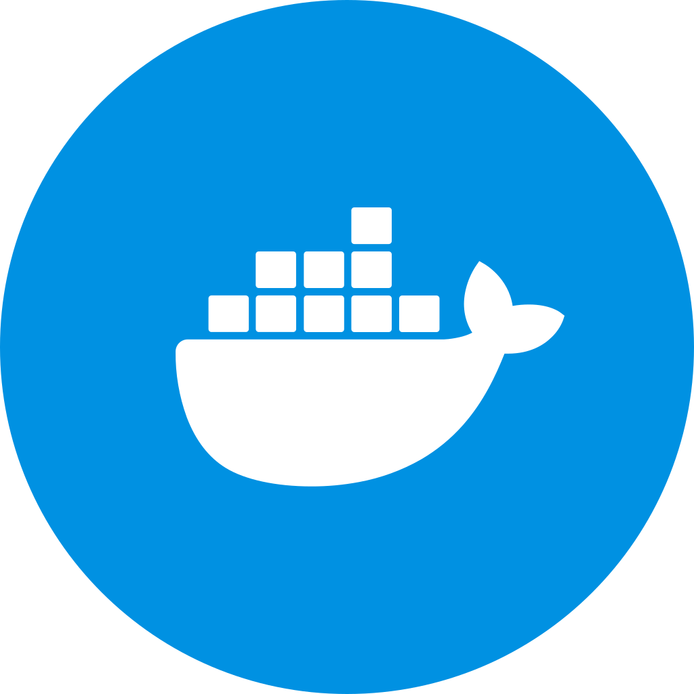
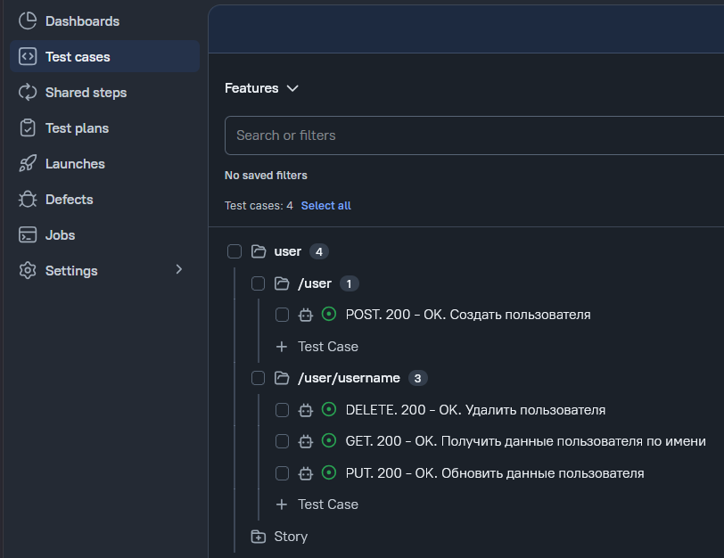
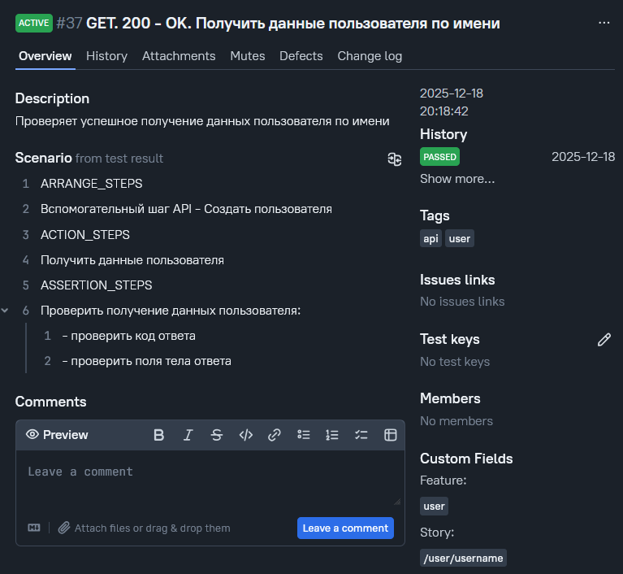
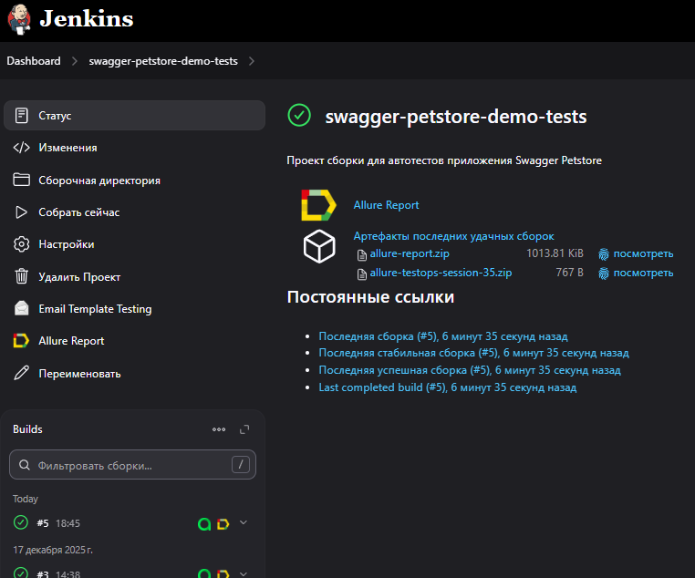
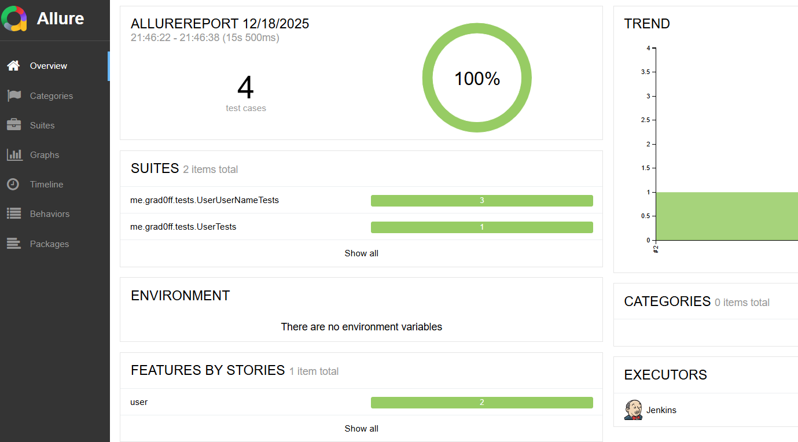
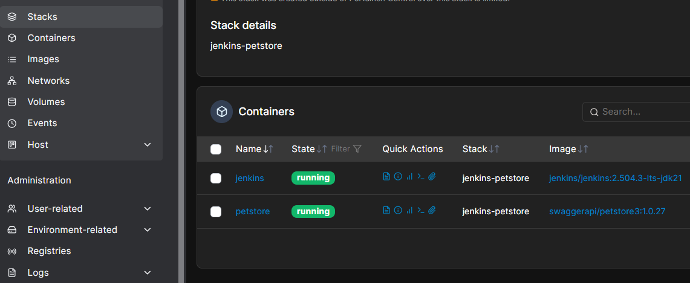

# Тесты веб-приложения Swagger Petstore

## Стек и технологии

\* Java, Junit 5, REST Assured, AssertJ, Gatling, Allure TestOps, Allure Report, Jenkins, Docker, Maven, GitHub, Telegram, Ubuntu

## Структура

Проект автотестов является многомодульным и состоит из 2 модулей:

* [api-tests](api-tests) (тесты API)
* [performance-tests](performance-tests)  (тесты производительности)

## Тесты API

Разработаны тесты на компоненты:

* 🟢 user
* ⚪️ store
* ⚪️ pet

## Тесты производительности

Разработаны сценарии проверки:

* ⚪️ авторизация + поиск + покупка

## Тест-менеджмент

### Allure TestOps

TMS доступен по [ссылке](https://peachrey.testops.cloud/project/1/dashboards) (_пока действует триал_)

Реализованы возможности:

* 🟢 генерация тест-кейсов в Allure TestOps из кода
* ⚪️ интеграция c Jenkins (запуск проверок, выгрузка отчетов)

    
     
    

## Отчетность

### Allure Report

Реализованы возможности:

* 🟢 генерация Allure отчетов по каждому запуску

    

## CI

### Jenkins

Реализованы возможности:

* 🟢 интеграция с Allure TesOps
* ⚪️ рассылка уведомлений и отчетов в Telegram и Email

    

## VM

В Docker запущены контейнеры с приложениями:

* 🟢 Jenkins
* 🟢 Swagger Petstore

    

## Код

Код проекта в Github [swagger-petstore-demo-tests](https://github.com/grad0ff/swagger-petstore-demo-tests.git)

